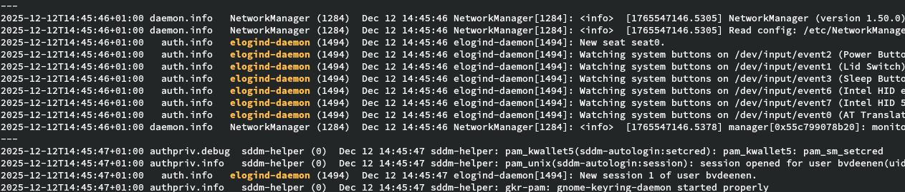

# svlogj
Frontend for svlogtail in Void Linux.

Inspired by the userinterface of `journalctl` from the `systemd` suite.

Has the following features
* uses `svlogtail` for collecting the logs. Nothing `svlogj` does could not be done with a combination of `svlogtail` and `awk`
* parses the `config` files as well as the output of `svlogtail` to build a dataset of available _facilities_, _levels_, _services_ and _entities_
  Use `svlogj create-config` to create `~/.config/svlogj.json`. You can inspect this file via `svlogj show-config` which provides a nice tabular output.
* Use sophisticated auto completion for `bash`, `zsh` and `fish`. Installation instructions via `svlogj completion bash|zsh|fish --help`
* use `svlogj` with filters to select things your interested in (Use `man logger` for information about _levels_ and _facilities_)
  * `svlogj --level ...` to show only messages with this level. Use the _tab completion!_
  * `svlogj --facility=...` to show only messages with this `facility`
  * `svlogj --service=...` executes `svlogtail <service>`. From `svlogtail --help`:
    Without arguments, show current logs of all services, uniquely. With arguments, show all logs of mentioned services
  * `svlogj --entity`. The _entities_ are what was writing the log message. The list of entities is heuristically defined during `svlogj create-config` by a few regular
    expressions on the output of `svlogtail`. This depends obviously on what you have running on your system. On my laptop we see for instance

        accounts-daemon           elogind-daemon            polkitd                   unix_chkpwd
        avahi-daemon              fingerprint-polkit-agent  sddm                      useradd
        chrome                    groupadd                  sddm-helper               usermod
        chronyd                   interval                  sshd                      version
        client                    login                     su                        xbps-install
        dbus                      mtp-probe                 sudo                      xbps-remove
        dbus-daemon               NetworkManager            systemsettings
        dhcpcd                    options                   tlp
  * `grep` style `before`, `after` and `context` flags, so you can easily see what happened around your line of interest
  * colorization of the output (which can ofcourse be disabled)

Example:

    svlogj --entity elogind-daemon -B2 --after=1 --time-config local

# Full documentation
The best documentation will always be using the tool itself: `svlogj help <command>` or `svlogj <command> <subcommand> --help`

    svlogj help
    Frontend for svlogtail in Void Linux

    Usage:
    svlogj [flags]
    svlogj [command]

    Available Commands:
    ansi-colors   shows ansi colors for use with the --ansi-color flag
    completion    generate a completion for your shell
    create-config create a configuration file ~/.config/svlogj.json
    help          Help about any command
    show-config   shows the config on stdout
    version       returns the version

    Flags:
    -A, --after int            grep after
    --ansi-color string        ansi color for match (default "1;33")
    -B, --before int           grep before
    -C, --context int          grep context
    -e, --entity string        select entity
    -f, --facility string      select facility
    --follow                   follow (default true)
    -h, --help                 help for svlogj
    -l, --level string         select level
    --monochrome               monochrome output
    -s, --service string       select service
    --time-config string       timeconfig

    Use "svlogj [command] --help" for more information about a command.

## environment variables.

	SVLOGJ_FOLLOW when present means svlogj will tail follow the log
    SVLOGJ_MONOCHROME when present no output colorization
    SVLOGJ_ANSICOLOR when present defines the coloring for the matches. Defaults to '1;33'
    SVLOGJ_TIMECONFIG defines default timestamp formatting (currently local, and uptime_s)
    SVLOGJ_SOCKLOGDIR where's the socklog directory (default /var/log/socklog)

## the socklog group

The tool is meant to be run as your regular user, so no _sudo_. If you're not yet member of `socklog` you can execute these steps.

    sudo usermod -aG socklog $USER
    newgrp socklog

The `newgrp socklog` is only for necessary as you long as you have not logged out and back in again.
